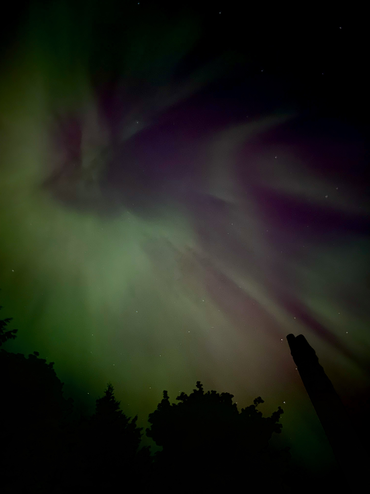
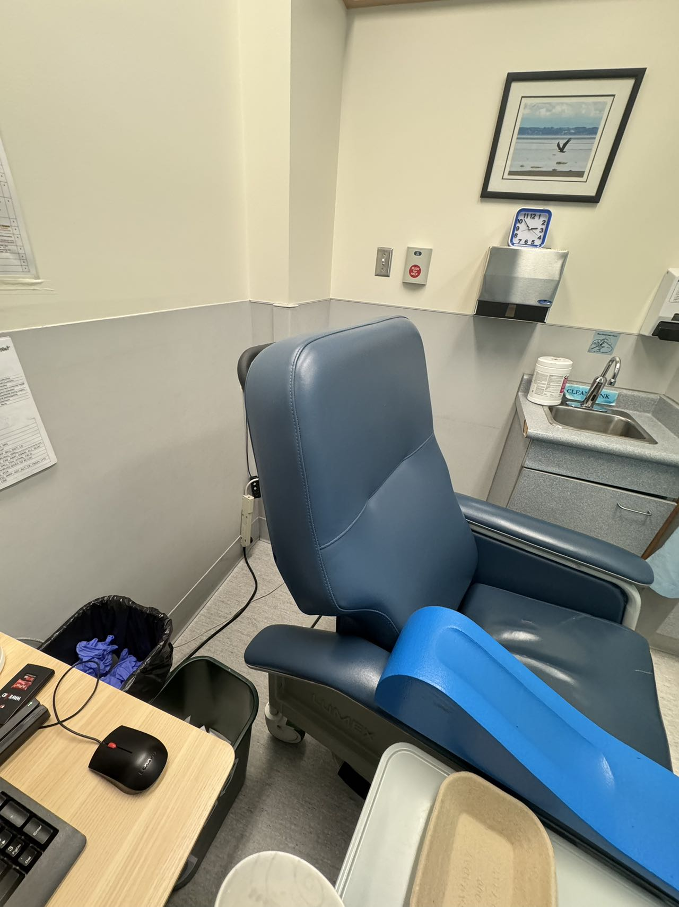
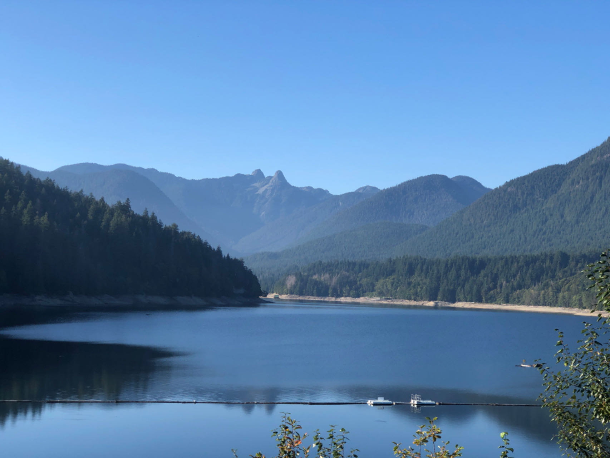
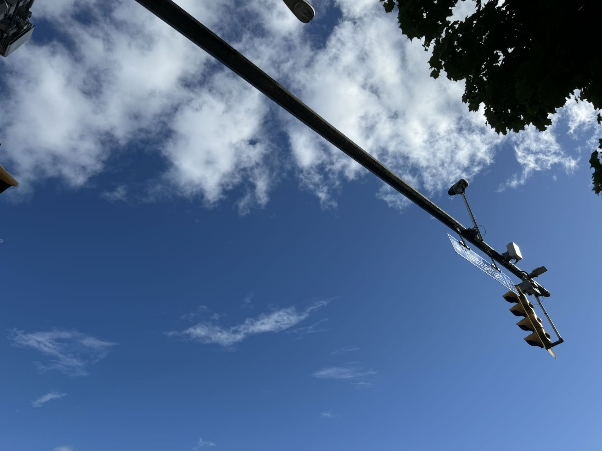

# Gallery of Activities

Below is a gallery showcasing various activities, each with a date, photo, and a brief description.

````{grid} 2
:gutter: 2
:padding: 10px

```{grid-item-card}
:text-align: center

**Date: 2023-05-11**


*Aurora - Apparently this was the result of a "G5" level solar/geomagnetic storm (the highest category), the first since 2003..*
```

```{grid-item-card}
:text-align: center

**Date: 2023-06-**


*Laboratory service at UBC hospital - First time visit student health service. The healthcare professioal was very friendly and supportive.*
```

```{grid-item-card}
:text-align: center

**Date: 2023-06-15**


*Capilano River Regional Park - Beautiful.*
```

```{grid-item-card}
:text-align: center

**Date: 2023-06-22**


*Beautiful day in Vancouver. As final period approaches, I find myself learned so many useful things. Here's clear skies and better days ahead, both in weather and in life.*
```
````